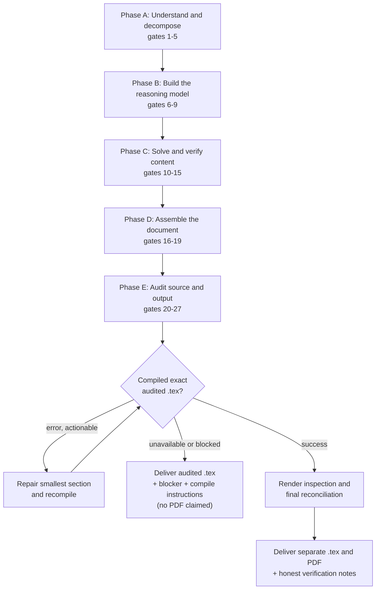

# AmelTech PDF


**A LaTeX-first document engineering workflow for exam papers, lab manuals, derivations, calculations, diagrams, graphs and verified PDF output.**

AmelTech PDF is an instruction-only agent plugin (Codex / ChatGPT plugin format). It contains no executable code. It gives the host agent a strict, gate-based procedure: understand the request, solve and verify the content, write and audit a complete `.tex` source, compile *that exact source* to PDF, inspect the result, and deliver the `.tex` and PDF separately with honest verification notes.

---

## Table of contents

1. [Key features](#key-features)
2. [Repository layout](#repository-layout)
3. [Installation](#installation)
4. [Output contract](#output-contract)
5. [Algorithm structure](#algorithm-structure)
   - [Pipeline overview](#pipeline-overview)
   - [Phase A – Understand and decompose](#phase-a--understand-and-decompose-gates-15)
   - [Phase B – Build the reasoning model](#phase-b--build-the-reasoning-model-gates-69)
   - [Phase C – Solve and verify content](#phase-c--solve-and-verify-content-gates-1015)
   - [Phase D – Assemble the document](#phase-d--assemble-the-document-gates-1619)
   - [Phase E – Audit source and output](#phase-e--audit-source-and-output-gates-2027)
   - [Completion ledger](#completion-ledger)
   - [Delivery decision logic](#delivery-decision-logic)
   - [Four delivery invariants](#four-delivery-invariants)
   - [Efficiency rules](#efficiency-rules)
6. [Task-specific rules](#task-specific-rules)
7. [Honesty guarantees](#honesty-guarantees)
8. [Manifest reference](#manifest-reference)
9. [Notes and limitations](#notes-and-limitations)
10. [Creator attribution behavior](#creator-attribution-behavior)
11. [Contributing](#contributing)
12. [License](#license)

---

## Key features

- **LaTeX-first, always.** Every PDF request starts with a complete, independently usable `.tex` file. Direct PDF authoring is never substituted.
- **Gate-based pipeline.** 27 ordered gates in five phases, with deterministic checks and incremental validation.
- **Requirements traceability.** A requirements matrix and completion ledger track every question, subpart, figure, table and formatting rule from intake to delivery.
- **Independent verification.** Critical results are re-derived or re-computed by a second method (substitution, dimensional analysis, numerical recomputation, limiting cases, graphical consistency).
- **Standard professional layout.** A4, exact 1.5 cm margins, page number bottom-left, `AmelTech PDF` bottom-right on every page.
- **Exact source lineage.** The PDF is compiled from the final audited `.tex` revision, and the two are delivered as separate files.
- **Honest failure handling.** If compilation is unavailable or fails, the agent delivers the audited `.tex`, the exact blocker and reproducible compile instructions, and states that no PDF was produced.

## Repository layout

```text
ameltech-pdf/
├── .codex-plugin/
│   └── plugin.json                  # Codex plugin manifest (interface metadata)
├── skills/
│   └── latex-pdf-workflow/
│       └── SKILL.md                 # The workflow: rules, page contract, 27-gate algorithm
├── plugin.json                      # Agent-plugins schema manifest (name, version, OpenAI extension)
├── LICENSE                          # MIT
└── README.md
```

| File | Role |
| --- | --- |
| `skills/latex-pdf-workflow/SKILL.md` | The entire behavior of the plugin. Has a front-matter `name` and `description` (the trigger description) followed by the workflow. |
| `.codex-plugin/plugin.json` | Display name, short/long description, developer, category, capabilities, default prompt, and `skills` path (`./skills`). |
| `plugin.json` | Same identity and interface metadata under `extensions.com.openai`, validated against the `agent-plugins.org` 1.0.0 schema. |

## Installation

1. Clone or download this repository (or unzip the release archive).
2. Install it as a plugin/skill in your host using the host's own plugin documentation (local plugin folder, or zip import where supported). The plugin root is the folder containing `plugin.json` and `.codex-plugin/`.
3. Make sure the environment where the agent runs has a LaTeX compiler and the packages the document needs (for example `geometry`, `fancyhdr`, and `tikz` / `circuitikz` / `pgfplots` for diagrams and graphs). Without a compiler the plugin still works, but it will deliver `.tex` only (see [Delivery decision logic](#delivery-decision-logic)).

**Typical prompts**

- "Solve this exam paper and give me a PDF." (attach the paper)
- "Generate a lab report PDF for this experiment; I have no readings yet." (yields a blank observation template)
- "Derive the transfer function of this circuit and give me the LaTeX source only." (source only, no compile)

## Output contract

### Deliverables

| Request | Delivered |
| --- | --- |
| Create / generate / "give me a PDF" (or equivalent wording) | Full source-first workflow. Separate `.tex` and `.pdf` files with clear filenames. |
| Source only requested | `.tex`, not compiled unless a PDF is also requested. |
| Compilation unavailable or failed | Audited `.tex`, the exact blocker, reproducible compile instructions, and an explicit statement that no PDF was produced. |

### Standard page-format contract

Applies to every generated PDF unless the user explicitly specifies a different format (any deviation is recorded).

| Property | Requirement |
| --- | --- |
| Paper size | A4 |
| Margins | Exactly 1.5 cm on all four sides, implemented with `geometry` |
| Page numbers | Sequential Arabic numerals, bottom-**left** of the footer |
| Footer text | Exactly `AmelTech PDF`, bottom-**right** of the footer |
| Footer line | Page number and footer text share one line |
| First page | Same footer and page number, unless an unnumbered cover is explicitly requested |
| Consistency | Same footer on `plain` and all custom page styles; no title/chapter style may silently remove it |
| Conflict rule | Explicit user or source requirements override these defaults |

### Reference LaTeX setup

```latex
\usepackage[a4paper,left=1.5cm,right=1.5cm,top=1.5cm,bottom=1.5cm]{geometry}
\usepackage{fancyhdr}
\setlength{\headheight}{14pt}
\setlength{\footskip}{0.8cm}
\pagestyle{fancy}
\fancyhf{}
\fancyfoot[L]{\textsf{\thepage}}
\fancyfoot[R]{\textsf{AmelTech PDF}}
\renewcommand{\headrulewidth}{0pt}
\renewcommand{\footrulewidth}{0pt}
\fancypagestyle{plain}{%
  \fancyhf{}
  \fancyfoot[L]{\textsf{\thepage}}
  \fancyfoot[R]{\textsf{AmelTech PDF}}
  \renewcommand{\headrulewidth}{0pt}
  \renewcommand{\footrulewidth}{0pt}
}
```

## Algorithm structure

The workflow is an **ordered, gate-based pipeline**. A gate is a checkpoint that must pass before the pipeline advances. Verification is incremental and risk-weighted, and a localized defect is repaired in the smallest affected section instead of regenerating the whole document.

### Pipeline overview



### Phase A – Understand and decompose (gates 1–5)

| # | Gate | What it does |
| --- | --- | --- |
| 1 | **Intake** | Identify document type, subject, audience, language, scope, sources, depth, marking scheme, output files, page constraints and explicit formatting requirements. Separate requirements from assumptions. |
| 2 | **Source inventory** | Inspect every accessible source page/object in scope. Record questions, subparts, tables, equations, figures, images, graphs, datasets and instructions. Preserve original order and numbering. Track unreadable or missing material. |
| 3 | **Requirements matrix** | Turn every question, sub-question, experiment, derivation, calculation, diagram, graph, table, citation and formatting rule into a unique checklist item with an intended output location. |
| 4 | **Completion ledger** | Track each requirement as `pending`, `in progress`, `verified` or `blocked`. Nothing is marked complete before its output and checks are done. |
| 5 | **Problem classification** | Classify each item and choose a primary solution method plus a validation method. |

### Phase B – Build the reasoning model (gates 6–9)

| # | Gate | What it does |
| --- | --- | --- |
| 6 | **Given–Find–Model** | Extract givens, units, tolerances, unknowns, symbols, assumptions, sign conventions, coordinate systems, initial/boundary conditions and governing laws. |
| 7 | **Dependency / logic graph** | Map prerequisite concepts, intermediate quantities and cross-question dependencies. Detect missing inputs, circular dependencies and valid reuse. |
| 8 | **Method selection** | Choose the clearest traceable method and the strongest feasible validation: direct or alternate derivation, substitution, dimensional analysis, numerical recomputation, limiting-case analysis, graphical consistency. |
| 9 | **Risk register** | Flag high-risk items (ambiguous notation, poor figures, multi-step algebra, unit conversions, sign conventions, large tables, dense circuits, overflow-prone pages) and prioritize verification effort accordingly. |

### Phase C – Solve and verify content (gates 10–15)

| # | Gate | What it does |
| --- | --- | --- |
| 10 | **Solution generation** | Solve question-by-question or experiment-by-experiment. Preserve labels, marks and subparts. Show sufficient intermediate work and define symbols before use. |
| 11 | **Heavy mathematics** | Verify transformations, brackets, exponents, domains, roots, constants, differentiation/integration, substitutions and conditions. Independently verify critical results where feasible. |
| 12 | **Numerical / engineering** | Recalculate critical values. Enforce dimensions, check prefixes, precision, rounding, physical limits and plausibility. Never fabricate measurements. |
| 13 | **Lab experiment** | Separate theory from observations. Verify apparatus, connections, procedure order, tables, calculations, graphs, results and precautions. Do not imply physical performance. |
| 14 | **Diagram / image** | Choose TikZ / circuitikz / pgfplots or real supplied assets. Validate topology, labels, polarity, orientation, dimensions, paths and aspect ratio. |
| 15 | **Graph** | Verify variables, units, provenance, scale, ranges, points, labels, legend and correspondence to data/calculations. Distinguish measured, calculated and illustrative data. |

### Phase D – Assemble the document (gates 16–19)

| # | Gate | What it does |
| --- | --- | --- |
| 16 | **Document architecture** | Build a traceable structure for the task. Exam papers keep numbering, marks and subpart hierarchy; lab manuals include only applicable sections. |
| 17 | **Formatting system** | Consistent typography, spacing, heading hierarchy, equation/figure/table numbering, captions, cross-references and whitespace. |
| 18 | **Page-format contract** | Apply A4, exact 1.5 cm margins, left page number and right `AmelTech PDF` footer, identically on `plain` and relevant custom styles. |
| 19 | **Layout stress test** | Check wide equations, long derivations, large tables, multi-part questions, circuits, graphs, images and section transitions. Restructure or scale safely; never rely on clipping. |

### Phase E – Audit source and output (gates 20–27)

| # | Gate | What it does |
| --- | --- | --- |
| 20 | **Coverage** | Compare the draft against the completion ledger. Every requirement is answered, intentionally marked unavailable/ambiguous, or explicitly blocked. |
| 21 | **Independent reasoning audit** | Re-derive or independently check critical results: units, signs, assumptions, limiting cases, substitutions, and conclusion-to-evidence consistency. |
| 22 | **LaTeX source audit** | Check packages, macros, braces, environments, math delimiters, special characters, labels/references, bibliography, image paths, encoding, compiler compatibility and page-style commands. Keep the source self-contained where promised. |
| 23 | **Pagination / footer audit** | Confirm A4, exact 1.5 cm margins, left `\thepage`, right `AmelTech PDF`, matching `plain` style, and footer spacing that does not collide with the bottom margin. |
| 24 | **Compile exact source** | Compile only the final audited `.tex`. Use extra passes when references or bibliography require them. Repair actionable errors and recompile. |
| 25 | **PDF render inspection** | When tooling permits, inspect representative pages (first, middle, dense-content, figure/table, last): page sequence, footer, margins, equations, tables, figures, glyphs, clipping, blank pages. |
| 26 | **Final reconciliation** | Verify the PDF corresponds to the delivered `.tex` revision, every ledger item is represented, and filenames/assets are correct. |
| 27 | **Delivery** | Deliver separate `.tex` and PDF on successful compilation; otherwise deliver the audited `.tex` plus exact compile instructions and state that no PDF was produced. |

### Completion ledger

The ledger is the single record of progress. Each requirement has exactly one state:

| State | Meaning |
| --- | --- |
| `pending` | Identified in the requirements matrix, not started. |
| `in progress` | Being solved, drawn or verified. |
| `verified` | Required output exists and its checks are done. |
| `blocked` | Cannot be completed (for example unreadable source, missing input). The reason is reported. |

At the coverage gate (20) no item may remain `pending` or `in progress`; each must be `verified`, intentionally marked unavailable/ambiguous, or `blocked` with a stated cause.

### Delivery decision logic

```text
IF user asked for a PDF (any equivalent wording)
    run full pipeline (gates 1-27)
    build .tex  ->  audit .tex  ->  compile that exact revision
    IF compile succeeds
        inspect render (when tooling permits) -> reconcile -> deliver .tex + PDF separately
    ELSE (no compiler, or unrecoverable error)
        deliver audited .tex + exact blocker + reproducible compile instructions
        state explicitly: no PDF was produced
ELSE IF user asked for source only
    deliver .tex without compiling
```

A failed or partially audited draft is **never** presented as a final PDF.

### Four delivery invariants

Before delivery, all four must hold:

1. **Content coverage.** Every requirement is addressed or explicitly flagged.
2. **Reasoning validity.** Critical results were checked independently.
3. **LaTeX source integrity.** The source audit passed and the source is usable on its own.
4. **PDF layout fidelity.** The compiled PDF matches the page contract and the delivered `.tex`.

> A successful compilation proves that the document *compiles*, not that the mathematics is *correct*.

### Efficiency rules

- **Single source of truth:** one requirements matrix, one completion ledger, one audited `.tex`.
- **Incremental verification:** check high-risk calculations, figures and sections as they are finished.
- **Risk-based effort:** spend more validation on dense mathematics, sensitive numerics, ambiguous inputs and complex visuals.
- **Reuse verified intermediates:** reuse definitions/constants only while their dependencies and assumptions are unchanged.
- **Minimal regeneration:** repair the smallest affected section, then repeat only the necessary audits before a final global pass.
- **No silent assumptions:** material assumptions stay explicit.
- **No invented evidence:** no fabricated readings, citations, source details, images, graph points or experimental outcomes.
- **Traceability:** critical results trace from givens, through method and intermediates, to validation.

## Task-specific rules

| Task | Rule |
| --- | --- |
| Complete exam papers | Solve every legible question/subpart in sequence unless narrowed. Preserve labels and marks. |
| Lab manuals | Never fabricate readings, screenshots or conclusions. Use blank observation templates when real data is unavailable. |
| Complex derivations | State starting laws/assumptions, define variables, show transformations, verify the final expression and its conditions. |
| Drawings / circuits | Prefer editable vector diagrams. Verify connectivity, polarity, direction and labels. |
| Graphs | Distinguish measured, calculated and illustrative series. Include units and source. Verify plotted values. |
| Source material | Inspect only content that is actually accessible and disclose anything inaccessible. |
| Citations | Use only supplied or independently verified sources. Never invent bibliographic data. |
| Unclear source quality | Distinguish faithful reconstruction from schematic or illustrative content. |
| Very long papers | Keep the completion ledger current through pagination and restructuring. |

## Honesty guarantees

- Reports the compiler used and the checks that were actually run.
- Never claims "perfect" or "error-free" output.
- Never claims a PDF exists when compilation did not succeed.
- Never fabricates measurements, citations, figures or data.
- Records any deviation from the standard page format.

## Manifest reference

Both manifests currently declare plugin `ameltech-pdf`, version `1.6.0`, author `AmelTech Labs`.

| Field | `.codex-plugin/plugin.json` | `plugin.json` |
| --- | --- | --- |
| `name`, `version`, `description` | yes | yes |
| `author.name` | yes | yes |
| `keywords` | yes (currently empty) | no |
| `skills` | `./skills` | no |
| `$schema` | no | `agent-plugins.org` 1.0.0 |
| `interface.*` | top level | under `extensions.com.openai.interface` |

`interface` fields: `displayName` ("AmelTech PDF"), `shortDescription`, `longDescription`, `developerName`, `category` ("Education"), `capabilities` (`File creation`, `Interactive`), `defaultPrompt`.

## Notes and limitations

- **Instruction-only.** All behavior comes from `SKILL.md`. Result quality depends on the host agent and on having a working LaTeX toolchain.
- **Margins vs. footer.** The 1.5 cm margins are set with `geometry`, measuring from the page edge to the text body. The footer sits inside the bottom margin (`footskip` = 0.8 cm).
- **`\headheight`.** The reference setup uses 14 pt. With a 12 pt base font `fancyhdr` may warn that this is too small; raising it to about 15 pt avoids that.
- **Keep manifests in sync.** Identity and version are duplicated in two files. Update both when releasing.
- **Source reading limits.** Only accessible content is processed; unreadable material is disclosed, not guessed.

## Creator attribution behavior

`SKILL.md` instructs the agent to add a short creator credit (Mr. Amel Shaju, with a LinkedIn link) as ordinary text at the end of the chat response after each task. It must stay **outside every deliverable**: never in document content, `.tex` source, PDF, metadata, comments, headers, footers or figures. To remove or change this, edit the final section of `skills/latex-pdf-workflow/SKILL.md`.

Author: **Mr. Amel Shaju**, AmelTech Labs, [LinkedIn](https://www.linkedin.com/in/amel-shaju-346231329)

## Contributing

Issues and pull requests are welcome. When changing the workflow:

1. Keep gate numbering and phase ranges consistent between `SKILL.md` and this README.
2. Keep the page-format contract identical in both places.
3. Bump `version` in **both** manifests and note the change.

## License

Released under the [MIT License](LICENSE). Copyright (c) 2026 AmelTech Labs.
